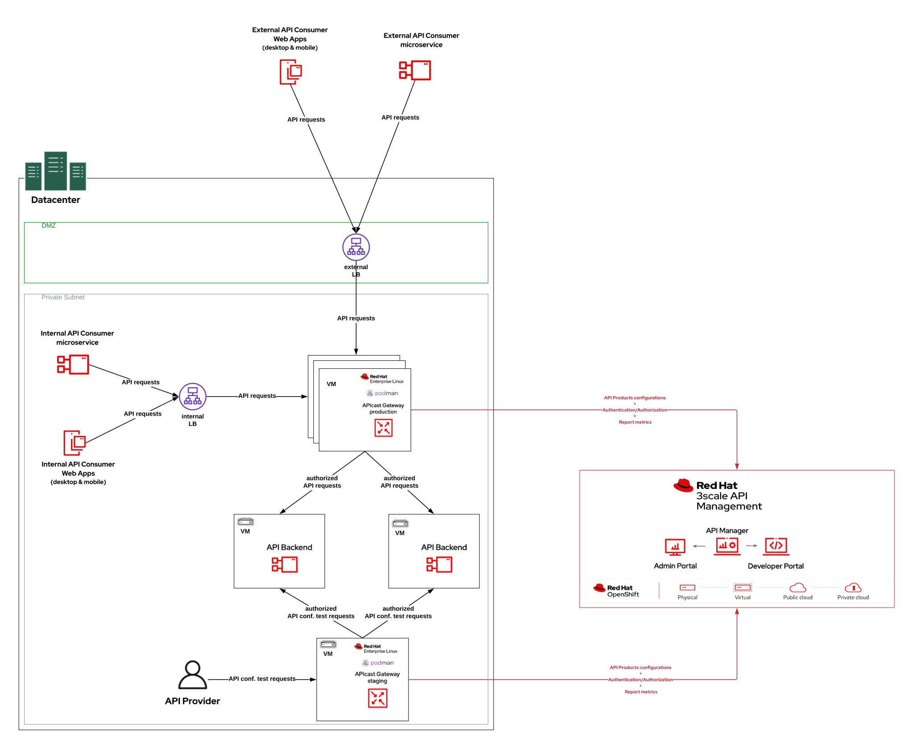

# 3scale-apicast-podman

## Purpose of this repository

This repository contains instructions for running [Red Hat 3scale APIcast Gateways](https://access.redhat.com/documentation/en-us/red_hat_3scale_api_management/2.13/html/installing_3scale/installing-apicast#doc-wrapper) outside of a [Red Hat OpenShift](https://access.redhat.com/products/openshift/) cluster. 

- The target hosts can be any [RHEL](https://access.redhat.com/products/red-hat-enterprise-linux/)-based host such as a virtual machine or an AWS EC2 instance.
- The [Red Hat 3scale APIcast Gateways](https://access.redhat.com/documentation/en-us/red_hat_3scale_api_management/2.13/html/installing_3scale/installing-apicast#doc-wrapper) can be fronted by a load-balancer/reverse-proxy for external/internal access by API consumers applications. An example of such  architecture would look like this:


Red Hat 3scale APIcast Gateway **version 2.13.4** is used in these instructions.

## Prerequisites

- Two virtual machines running [RHEL](https://access.redhat.com/products/red-hat-enterprise-linux/) v8.x or v9.x. One will be used for the [_staging_](https://access.redhat.com/documentation/en-us/red_hat_3scale_api_management/2.13/html/installing_3scale/installing-apicast#apicast-environment) APIcast gateway and the second one will be used for the [_production_](https://access.redhat.com/documentation/en-us/red_hat_3scale_api_management/2.13/html/installing_3scale/installing-apicast#apicast-environment) APIcast gateway.
- [Podman](https://access.redhat.com/documentation/en-us/red_hat_enterprise_linux/9/html/building_running_and_managing_containers/index) v4.x
    > **NOTE:** [Podman](https://access.redhat.com/documentation/en-us/red_hat_enterprise_linux/9/html/building_running_and_managing_containers/index) must have the credentials to connect to the public Red Hat container registry ([registry.redhat.io](registry.redhat.io)) in order to pull the APIcast image.
    - The `podman login` command can generate a file with credentials (`${XDG_RUNTIME_DIR}/containers/auth.json`). Example: `podman login registry.redhat.io` and then enter the service account credentials to connect.
    - See https://docs.podman.io/en/latest/markdown/podman-login.1.html
    - See https://access.redhat.com/terms-based-registry/ to create the service account associated with your Red Hat customer account.
- Access Token for the 3scale Account Management API.

## Instructions 

### 1. Staging APIcast Gateway

As a root user:

1. Create the `apicast-staging` container that will execute the [_staging_](https://access.redhat.com/documentation/en-us/red_hat_3scale_api_management/2.13/html/installing_3scale/installing-apicast#apicast-environment) APIcast gateway:

    >  **NOTE**: Replace the `Europe/Paris`, `<3scale_accountmgtapi_access_token>` and `<3scale_tenant_admin_endpoint>` values with the appropriate values according to your environment.

    ```shell script
    podman run --user 1001:0 --name apicast-staging  -p 8080:8080 -p 8090:8090  -p 9421:9421 \
    -e OPENSSL_VERIFY=false \
    -e APICAST_LOG_LEVEL=info \
    -e TZ=Europe/Paris \
    -e APICAST_EXTENDED_METRICS=true \
    -e APICAST_CONFIGURATION_CACHE=0 \
    -e APICAST_MANAGEMENT_API=status \
    -e APICAST_RESPONSE_CODES=true \
    -e APICAST_CONFIGURATION_LOADER=lazy \
    -e THREESCALE_DEPLOYMENT_ENV=staging \
    -e THREESCALE_PORTAL_ENDPOINT=https://<3scale_accountmgtapi_access_token>@<3scale_tenant_admin_endpoint> \
    registry.redhat.io/3scale-amp2/apicast-gateway-rhel8:3scale2.13.4
    ```

2. `Ctrl + C` to exit after having made sure, the container ran successfully.

    > **NOTE**: The `podman ps -a` command line should list the created `apicast-staging` container.

3. Create the [systemd](https://access.redhat.com/documentation/en-us/red_hat_enterprise_linux/9/html/configuring_basic_system_settings/introduction-to-systemd_configuring-basic-system-settings) service to manage the [_staging_](https://access.redhat.com/documentation/en-us/red_hat_3scale_api_management/2.13/html/installing_3scale/installing-apicast#apicast-environment) APIcast lifecycle:

    1. Create the `apicast-staging.service` file in the `/etc/systemd/system` directory with the following content:
        ```shell script
        [Unit]
        Description=Staging APIcast Gateway container
        After=network.target

        [Service]
        Restart=always
        ExecStart=/usr/bin/podman start -a apicast-staging
        ExecStop=/usr/bin/podman stop apicast-staging

        [Install]
        WantedBy=multi-user.target
        ```

    2. Enable automatic start of the `apicast-staging.service` on machine startup
        ```shell script
        systemctl enable apicast-staging.service
        ```

    3. Next:

        - To start the `apicast-staging.service`, run `systemctl start apicast-staging.service`
        - To stop the `apicast-staging.service`, run `systemctl stop apicast-staging.service`
        - To display staging APIcast logs, run `podman logs -f --names apicast-staging`

#### OPTIONAL: Create a TLS-enabled staging APIcast gateway service

1. Make sure your have the key pair (private and public) to secure the APIcast gateway service using TLS. E.g.
    - `/home/ec2-user/certs/apicast.crt`: the file containing the certification chain (CA) + the signed public certificate in PEM format
    - `/home/ec2-user/certs/apicast.key`: the file containing the private key in PEM format

2. Use the following content for the `podman` command lines to create the `apicast-staging` container:

    >  **NOTE**: Replace the `/home/ec2-user/certs`, `Europe/Paris`,`<3scale_accountmgtapi_access_token>` and `<3scale_tenant_admin_endpoint>` values with the appropriate values according to your environment.

    ```shell script
    podman unshare chown -R 1001:0 /home/ec2-user/certs

    podman run --user 1001:0 --name apicast-staging  -p 8443:8443 -p 8090:8090 -p 9421:9421 \
    -v /home/ec2-user/certs:/opt/app-root/src/conf/certs:Z \
    -e APICAST_HTTPS_CERTIFICATE=/opt/app-root/src/conf/certs/apicast.crt \
    -e APICAST_HTTPS_CERTIFICATE_KEY=/opt/app-root/src/conf/certs/apicast.key \
    -e APICAST_HTTPS_PORT=8443 \
    -e OPENSSL_VERIFY=false \
    -e APICAST_LOG_LEVEL=info \
    -e TZ=Europe/Paris \
    -e APICAST_EXTENDED_METRICS=true \
    -e APICAST_CONFIGURATION_CACHE=0 \
    -e APICAST_MANAGEMENT_API=status \
    -e APICAST_RESPONSE_CODES=true \
    -e APICAST_CONFIGURATION_LOADER=lazy \
    -e THREESCALE_DEPLOYMENT_ENV=staging \
    -e THREESCALE_PORTAL_ENDPOINT=https://<3scale_accountmgtapi_access_token>@<3scale_tenant_admin_endpoint> \
    registry.redhat.io/3scale-amp2/apicast-gateway-rhel8:3scale2.13.4
    ```

3. The rest of the instrucitons are the same as in the previous section.

### 2. Production APIcast Gateway

As a root user:

1. Create the `apicast-production` container that will execute the [_production_](https://access.redhat.com/documentation/en-us/red_hat_3scale_api_management/2.13/html/installing_3scale/installing-apicast#apicast-environment) APIcast gateway:

    >  **NOTE**: Replace the `Europe/Paris`, `<3scale_accountmgtapi_access_token>` and `<3scale_tenant_admin_endpoint>` values with the appropriate values according to your environment.

    ```shell script
    podman run --user 1001:0 --name apicast-production  -p 8080:8080 -p 8090:8090 -p 9421:9421 \
    -e OPENSSL_VERIFY=false \
    -e APICAST_LOG_LEVEL=info \
    -e TZ=Europe/Paris \
    -e APICAST_EXTENDED_METRICS=true \
    -e APICAST_CONFIGURATION_CACHE=300 \
    -e APICAST_MANAGEMENT_API=status \
    -e APICAST_RESPONSE_CODES=true \
    -e APICAST_CONFIGURATION_LOADER=boot \
    -e THREESCALE_DEPLOYMENT_ENV=production \
    -e THREESCALE_PORTAL_ENDPOINT=https://<3scale_accountmgtapi_access_token>@<3scale_tenant_admin_endpoint> \
    registry.redhat.io/3scale-amp2/apicast-gateway-rhel8:3scale2.13.4
    ```

2. `Ctrl + C` to exit after having made sure the container ran successfully.

    > **NOTE**: The `podman ps -a` command line should list the created `apicast-production` container.

3. Create the [systemd](https://access.redhat.com/documentation/en-us/red_hat_enterprise_linux/9/html/configuring_basic_system_settings/introduction-to-systemd_configuring-basic-system-settings) service to manage the [_production_](https://access.redhat.com/documentation/en-us/red_hat_3scale_api_management/2.13/html/installing_3scale/installing-apicast#apicast-environment) APIcast lifecycle:

    1. Create the `apicast-production.service` file in the `/etc/systemd/system` directory with the following content:
        ```shell script
        [Unit]
        Description=Production APIcast Gateway container
        After=network.target

        [Service]
        Restart=always
        ExecStart=/usr/bin/podman start -a apicast-production
        ExecStop=/usr/bin/podman stop apicast-production

        [Install]
        WantedBy=multi-user.target
        ```

    2. Enable automatic start of the `apicast-production.service` on machine startup
        ```shell script
        systemctl enable apicast-production.service
        ```

    3. Next:

        - To start the `apicast-production.service`, run `systemctl start apicast-production.service`
        - To stop the `apicast-production.service`, run `systemctl stop apicast-production.service`
        - To display staging APIcast logs, run `podman logs -f --names apicast-production`

#### OPTIONAL: Create a TLS-enabled production APIcast gateway service

1. Make sure your have the key pair (private and public) to secure the APIcast gateway service using TLS. E.g.
    - `/home/ec2-user/certs/apicast.crt`: the file containing the certification chain (CA) + the signed public certificate in PEM format
    - `/home/ec2-user/certs/apicast.key`: the file containing the private key in PEM format

2. Use the following content for the `podman` command lines to create the `apicast-production` container:

    >  **NOTE**: Replace the `/home/ec2-user/certs`, `Europe/Paris`,`<3scale_accountmgtapi_access_token>` and `<3scale_tenant_admin_endpoint>` values with the appropriate values according to your environment.

    ```shell script
    podman unshare chown -R 1001:0 /home/ec2-user/certs

    podman run --user 1001:0 --name apicast-production  -p 8443:8443 -p 8090:8090 -p 9421:9421 \
    -v /home/ec2-user/certs:/opt/app-root/src/conf/certs:Z \
    -e APICAST_HTTPS_CERTIFICATE=/opt/app-root/src/conf/certs/apicast.crt \
    -e APICAST_HTTPS_CERTIFICATE_KEY=/opt/app-root/src/conf/certs/apicast.key \
    -e APICAST_HTTPS_PORT=8443 \
    -e OPENSSL_VERIFY=false \
    -e APICAST_LOG_LEVEL=info \
    -e TZ=Europe/Paris \
    -e APICAST_EXTENDED_METRICS=true \
    -e APICAST_CONFIGURATION_CACHE=300 \
    -e APICAST_MANAGEMENT_API=status \
    -e APICAST_RESPONSE_CODES=true \
    -e APICAST_CONFIGURATION_LOADER=boot \
    -e THREESCALE_DEPLOYMENT_ENV=production \
    -e THREESCALE_PORTAL_ENDPOINT=https://<3scale_accountmgtapi_access_token>@<3scale_tenant_admin_endpoint> \
    registry.redhat.io/3scale-amp2/apicast-gateway-rhel8:3scale2.13.4
    ```
    
3. The rest of the instrucitons are the same as in the previous section.

## Trouble-shooting and operations

### Management endpoint - health check

The `http://<host>:8090/status/live` APIcast endpoint can be used to check the status of the service

### Metrics in Prometheus format

The `http://<host>:9421/metrics` APIcast endpoint exposes the gateway [metrics](https://access.redhat.com/documentation/en-us/red_hat_3scale_api_management/2.13/html/administering_the_api_gateway/prometheus-3scale-apicast#prometheus-3scale-metrics) in Prometheus format. 

### Verify the communication link with 3scale API Manager

1. Connect to the APIcast container terminal. Example:

    ```shell script
    podman exec -it apicast-production /bin/bash
    ```

2. Check that the APIcast gateway can download the services configuration:

     >  **NOTE**: Replace the `<3scale_tenant_admin_host>` and `<3scale_accountmgtapi_access_token>` with the appropriate value according to your environment.


    ```shell script
    curl -v "https://<3scale_tenant_admin_host>/admin/api/services.json?access_token=<3scale_accountmgtapi_access_token>"
    ```
